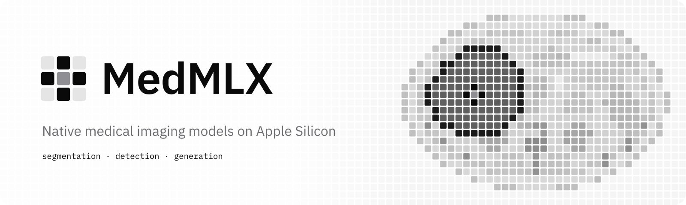

  <picture>
    <source media="(prefers-color-scheme: dark)" srcset="../brand/banner-dark.svg">
    
  </picture>

MedMLX reimplements published medical imaging models in [MLX](https://github.com/ml-explore/mlx) so they run natively on Apple Silicon, with no PyTorch or CUDA in the inference path. The ports cover segmentation, detection, and generation models.

### Repositories

| Repository | Description |
|---|---|
| [MLX-Reason-CT](https://github.com/MedMLX/MLX-Reason-CT) | MLX port of NVIDIA NV-Reason-CT for 3D CT report generation and question answering |

### Intended use

MedMLX is research software. It is not a medical device and is not for clinical use. Agreement with a reference implementation shows that a port reproduces the original model's outputs. It does not establish clinical validity.

MedMLX is an independent project and is not affiliated with Apple.
